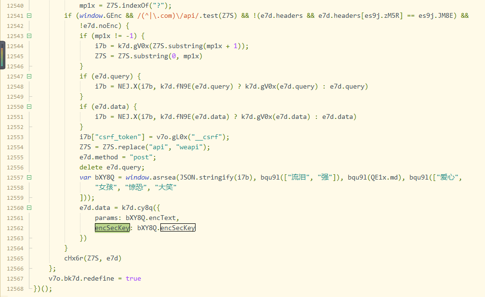

#### 抓取的网站：
网易云音乐的搜索接口
链接：https://music.163.com/#/search/m/?s=

利用fiddler发现搜索的接口在``https://music.163.com/weapi/cloudsearch/get/web?csrf_token=3a6d6d2bffa92505ec569303195a5f69``中

## 接口参数加密
**Composer的使用**

* 将上面的文件拖进Composer
（一个可以模拟发送请求的功能）
* 我们可以在Composer中看到该请求的请求类型 请求头 请求体


* 我们猜想的post请求中发送的数据应该是我们搜索的字符串(eg:搜索"明天"是发送的是字符串"明天")
* 但不是，发现其 发送的 body 是加密的东西

(eg:``params=%2BVmaHpF4MbXjR8qBueQQGquv2%2Bqjfqd71N%2FGHR%2FAxhVdNKcSw1gg6BufNXfCWh0o825IUr1kVThPHTHVuDQ2%2FV6qBNE1gWEsBZH5FfsvMB6C3khzhoCncg9xwb31MlJM0EqHfiHeGSmenL4uQQkFyq23Z2C6Nm6sBtDSaet6WOZ%2FzxtPZRiOL%2BUmbnTBzVZdekIndxyJRtm7q36eEseb7tb4Rw%2Bc52aiFqC31FN0nceCROsDVEbZ4KlMI6Qkf5uncR8xZfgplD2cm37z%2FDqll%2FL4RtJYP3MgXXwEonH9r8kSSHoTICh1zcFoCy18KeTJ&encSecKey=297e43a9aefce2e41dc81c40b7454452e3d1f1620d516ffb4086d6aaa6ed5c81d8d13bdb7aace487c0b050988b36e26c3c2c555473f7d7606556c853fa2a8e5edbe37de9522b60dc8042ed3a6944ca0cfef949eccb8c5711e0e24da7c8bb7fb98130a5d19f1d2a265d97155264fd9584af9cba2cac5c1f5f0db2d12c47c4c289``)

此时问题来了我们要拿到数据就得知道加密方法？？

## 试着解一下密

好吧，既来之则安之，我们尝试一下能不能解密~~~

* 首先根据网易云音乐的页面请求数据找到，调用了该接口的js文件 ``https://s3.music.126.net/web/s/core_e6ac0457c794e27e493f9a5e1d5016fe.js?e6ac0457c794e27e493f9a5e1d5016fe``
* 下载该文件，在本地更改（这里下载的这份文件有4万行，要读完它时间不允许呀！那怎么办）
* 别慌别慌，我们需要做的只是找到加密函数，其他的不管 

**Inspectors功能的使用**

* 我们点击我们的接口 在右边的Inspectors选项中观察一下，经过尝试我们发现接口URL 中``..._token=``后面的东西也就是下图（QueryString中csrf_token的值带与不带都不会影响数据的请求）


* 下来看Body 当我们搜索的值不同对应Body里面值一直都在变，那我们所要的加密的东西可能与这个值有关。

**encSecKey的使用**

* 在下载的js里面搜索 ``encSecKey`` 我们可以将搜索的范围缩小 代码主要集中在这个地方



* 分析下面的代码：显然我们想要的值是bXY8Q中的值经过函数cy8q()形成的。
```
  e7d.data = k7d.cy8q({
                params: bXY8Q.encText,
                encSecKey: bXY8Q.encSecKey
            })
```
* 上面刚好就有变量``bXY8Q``的赋值,用一个定义在全局的方法得到的 我们尝试打印一下该方法传入的四个参数 发现有一个参数是会随搜索值而改变的,并且该参数的值就是搜索值。
* 啊哈哈，发现了新大陆，我们尝试在赋值的前面直接手动改变变量看可不可以搜索出我们改变的值
```
 var bXY8Q = window.asrsea(JSON.stringify(i7b), bqu9l(["流泪", "强"]), bqu9l(QE1x.md), bqu9l(["爱心",
                "女孩", "惊恐", "大笑"
            ]));
            
            
            
 i7b.s="晴天"
            var bXY8Q = window.asrsea(JSON.stringify(i7b), bqu9l(["流泪", "强"]), bqu9l(QE1x.md), bqu9l(["爱心",
                "女孩", "惊恐", "大笑"
            ]));            
```
* 现在要说一个问题了如何在同样的环境下执行我们改后的代码呢。这就需要说到下面的工具了

**AutoResponder使用**

* 选择 AutoResponder 将源代码拖进去，勾选并在最下面附上你要更改后所用的js


* 好了尝试一下，成功了  啊哈哈幸福来得太突然。
* 现在我们要做的是将上面的立即执行函数领出来，封装成一个可以传参的函数
认真观察代码我们不能直接return 因为这是函数的嵌套加赋值，我尝试过定义全局变量，来判断全局变量的值改变时在函数末尾返回，（还是时代，内层的函数执行的只是赋值，函数没执行完，判断就已经生效了...头大）
* 此时想到了异步，想到了promise，就有了如下的代码
* 密钥我们已经解决了，下来如何自己创建一个node环境，引入这个js中这个函数 并将结果密钥返回。

## 尝试搭建node环境

* 直接上带代码吧
* 尝试用node跑了一下网易云的接口，是可以的，可以将自己的js引入就出现了问题 具体是因为 部分js代码noed无法执行（eg：document）...
* 这可是个大问题啊，4万行的代码 我就是想改也心有余而力不足...

```
const http = require('http'); //引入http文件 （require 引进nodejs中的http模块）
var request = require('request');
// var change=require('./xiugai');  出现问题--部分js代码noed无法执行  eg：document
//(function(){
    // change.changeString("你好",2).then((obj)=>{
    //     console.log(obj);
    // })
//})()

function  requesting(str){
    request({
	method: 'POST',
	url: 'https://music.163.com/weapi/cloudsearch/get/web',
	headers: {
		'Content-Type': 'application/x-www-form-urlencoded',
	},
    body:str
}, function(error, response, body) {
    	if (!error && response.statusCode == 200) {
        console.log(JSON.parse(body)) // 请求成功的处理逻辑
    }else{
        console.log({state:response.statusCode});
    }
    });
}

requesting("params=47DUJ6EbePsep8qQBYhQZ0%2FUow0NNzZDZ%2FE6341SiRtMYmdEpeus%2BDa3o9rJnhqcjZsaRfKU5gfIjJTi5U7mlQczNFsBKWS%2FWRyMJFPPOTqQBhj%2FYKtRyr%2F5UYdbgSM67J%2FFmKKZzDf9MpzdjUqWd1NSDYhaoW5gFptaLQINYQB0MZp%2BUflYMZpDJ%2BCco%2BBsXd2u21F0mPs54jPBYPf8ZzTzAw5OnHDBChRgvqiK8sMJBwtfp6jb1CzBg%2BXowOm3aTFniIAZ%2FuyNvuBfbWsOFUF8mQtzprCQS8gNIsoBVu0%3D&encSecKey=8082fd17a1e1bcb78707dc72b878e433e96f9b60a6eadb4947c711745801d2b015aed52c424e4fa4d182fc7685c714c3b9727b69f6f706dba7cfb80fa478616aa2510e37658e91d64d69b02cecbed28d5841c6209d949283f22ae01be5b1b1537c4f636767e552f835ab8d51f56aebccd47cb18c7dfa8e847f77c1842cc00862")

var server=http.createServer(function(req,res){
   
});

server.listen(8088); //端口号 localhost:8080
```
* 到此，此方案宣告失败~~

## 在浏览器环境下执行 js
* 在浏览器环境下执行我们的js代码，每次请求数据都经过这个浏览器过滤
* 确实代码太长 下载会影响少许的体验感，但目前没有想到更好的办法
* 上面的代码存在问题，脱离了网易云这个环境，我定义的函数 changeString无法自执行，认真看标注的部分，这里进行的仅仅是一个赋值，并没有执行，触发执行的代码，可能在别的文件里面。
* 还有一个问题，因为这个文件的打包会将变量名替换成随意的字符串，相当于每次下带的js代码都是不同的，因为每次打包都回随机改变变量名...

这次的总结就到这了，虽说最后失败了。

不过，俗话说的好失败时成功它妈嘛~~~~~~
